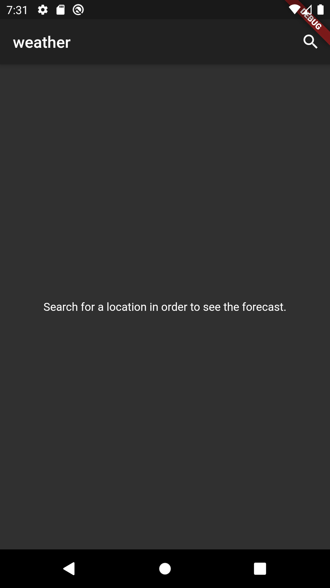
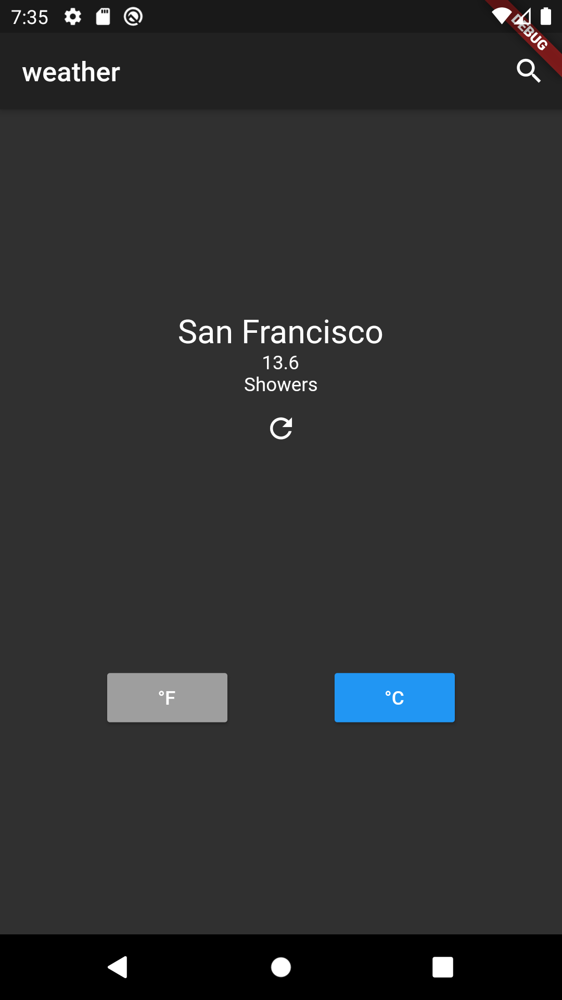

# Weather App

See the weather for any location!

### About

Built with [MetaWeather API](https://www.metaweather.com/api/), this application helps users find the weather for any specified location.

Temperature is shown in either metric or imperial system.






## Instructions

How to run the project.

### Prerequisites

What things you need to install and how to install them.

1. Flutter SDK - [installation guide](https://flutter.dev/docs/get-started/install);
2. Your favorite IDE (Intellij, Android Studio, others) or Code Editor;
3. An Android/iOS Device or Emulator.

### Next Step
Download the source code.

### Running

In the command-line - type the command:
```shell
flutter run lib/main.dart
```

## Coding Style

This project uses [static analysis](https://github.com/nicovlad16/google-flutter-projects/blob/master/analysis_options.yaml) together with [Github Actions](https://github.com/nicovlad16/google-flutter-projects/actions).

This helps in bug-prevention and ensures that the code conforms with the Flutter and Dart style guidelines.
